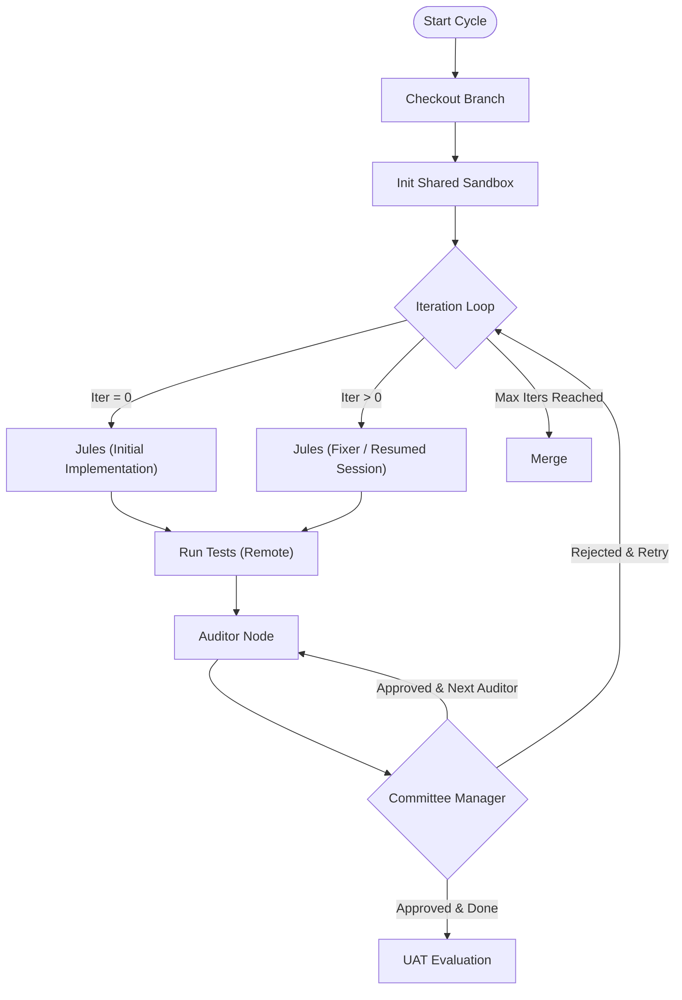

# AC-CDD Internal Development Flow

This document explains the internal architecture, logic, and resources used by the AC-CDD agent system.
It is designed to provide complete transparency into "who is doing what" during the development lifecycle.

## 🌟 Core Philosophy

AC-CDD (Autonomous Cycle-Based Contract-Driven Development) is built on six foundational pillars:

1.  **Contract-Driven**:
    -   Specifications (`SPEC.md`) are the **absolute source of truth**.
    -   Code is implemented *strictly* to satisfy the contract, not based on assumptions.
    -   Deviations from the spec are treated as defects.

2.  **Cycle-Based Development**:
    -   Complex projects are broken down into manageable, sequential **Cycles**.
    -   Each cycle focuses on a specific set of features or components.
    -   This prevents "Big Bang" integration hell and ensures steady progress.

3.  **AI-Native Architecture**:
    -   The system is designed *for* AI agents, not just *with* them.
    -   **Architect Agent**: Designs the system.
    -   **Coder Agent**: Implements the logic.
    -   **Auditor Agent**: Enforces quality.
    -   **QA Agent**: Verifies behavior.

4.  **Schema-First & TDD**:
    -   **Data Structures First**: Pydantic models are defined before any business logic.
    -   **Tests Second**: Tests are written against the schemas (TDD) before implementation.
    -   **Logic Last**: Implementation is written only to satisfy the tests.

5.  **Human-in-the-Loop (Strategic)**:
    -   Humans operate at the **Strategic Level** (Architecture & Review), not the **Tactical Level** (Coding).
    -   Users review the generated Architecture and the final Pull Request.
    -   The AI handles the implementation details, testing, and fixing.

6.  **Fully Remote Execution**:
    -   All execution happens in secure, ephemeral sandboxes (E2B).
    -   No "it works on my machine" issues.
    -   Protects the user's local environment from side effects.

## 🏗 System Architecture

AC-CDD utilizes a **Hybrid Agent System** orchestrated by **LangGraph**. It combines the autonomous capabilities of Google's Jules API for implementation and fixing with **LLMReviewer** for direct API-based code auditing.

### Role & Tool Mapping

| Role | Tool / API | Model Configuration | Responsibility | Execution Environment |
|---|---|---|---|---|
| **Architect** | **Google Jules API** | Standard Jules Model | Analyzes requirements (`ALL_SPEC.md`), designs architecture, and generates `SPEC.md` and `UAT.md`. Operates in a text-only mode. | Cloud (Jules Session) |
| **Coder (Initial)** | **Google Jules API** | Standard Jules Model | Performs the **Initial Implementation** (Iteration 0). Scaffolds the project based on specs. | Cloud (Jules Session) |
| **Coder (Fixer)** | **Google Jules API** | **Smart Model** (e.g., Claude 3.5 Sonnet) | Handles **Refinement & Repair** (Iteration > 0). Resumes the session to fix issues identified by the auditor. | Cloud (Jules Session) |
| **Auditor** | **LLMReviewer** | **Fast Model** (e.g., Gemini 2.0 Flash) | Strictly reviews code in **Read-Only** mode. Uses direct LLM API calls to analyze files and generate strict feedback. | Local / Direct API |
| **Orchestrator** | **LangGraph** | N/A | Manages the state machine, transitions between agents, and handles failure recovery. | Local Container |

## 🔄 Detailed Workflow Logic

The system operates in two main phases: **Architecture** and **Coding**.

### 1. Architect Phase (`gen-cycles`)
*   **Input**: `dev_documents/ALL_SPEC.md` (Raw User Requirements)
*   **Process**:
    1.  **JulesClient** initiates a session with the Architect Persona (`ARCHITECT_INSTRUCTION.md`).
    2.  Jules analyzes requirements and outputs design documents in a strict `FILENAME:` format.
    3.  The client parses these blocks and writes them to disk.
*   **Output**: `SYSTEM_ARCHITECTURE.md`, `CYCLE{xx}/SPEC.md`, `CYCLE{xx}/UAT.md`, `plan_status.json`.

### 2. Coder Phase (`run-cycle --auto`)
This phase uses a **Fixed Iteration Loop** to force continuous improvement.
All heavy lifting (tests, fixing) happens in the **Shared Sandbox**.

#### Step-by-Step Logic
1.  **Iteration 0 (Creation)**:
    *   **Agent**: **Jules**.
    *   **Action**: Reads `SPEC.md` and implements the core logic from scratch in the cloud. The resulting PR is checked out locally, and files are synced to the sandbox.
2.  **Verification**:
    *   **Syntax Check**: `ruff` linting and formatting run inside the **E2B Sandbox** via `SandboxRunner`.
    *   **Test Execution**: `pytest` runs in the sandbox. Logs are captured.
3.  **Strict Audit (Committee Mode)**:
    *   **Agent**: **LLMReviewer** (Read-Only).
    *   **Committee Logic**: The code must pass **3 Sequential Auditors**.
        -   **Auditor #1**: Reviews. If Rejected → Back to Coder. If Approved → Pass to Auditor #2.
        -   **Auditor #2**: Reviews (Fresh check). If Rejected → Back to Coder. If Approved → Pass to Auditor #3.
        -   **Auditor #3**: Reviews (Final check). If Rejected → Back to Coder. If Approved → Cycle Complete.
    *   **Retries**: Each auditor step allows up to `REVIEWS_PER_AUDITOR` (default 2) attempts before failure.
4.  **Iteration > 0 (Refinement)**:
    *   **Agent**: **Jules** (Fixer).
    *   **Execution**: Resumes the original Jules session with the audit feedback as a prompt. Jules modifies the code to address the issues.
    *   **Sync**: Modified PR is checked out locally for the next round of verification.
5.  **Completion**:
    *   The loop continues until ALL auditors approve OR `MAX_ITERATIONS` is reached.
    *   The final state is committed to the integration branch.

## 🔍 Deep Dive: Core Mechanisms

### Feature 1: The RAD Pipeline (`gen-cycles`)
The "Rapid Application Design" pipeline transforms raw text into structured engineering artifacts without human intervention.
*   **Process**: The `ArchitectGraph` invokes the **Jules Architect**.
*   **Parsing Logic**: `JulesClient` monitors the agent's output stream in real-time. It uses robust regex matching to detect and extract file blocks.
*   **Result**: This allows the Architect to "write" complex file trees (specs, diagrams, plans) simply by outputting text.

### Feature 2: The Iterative Audit Loop (Committee)
AC-CDD enforces quality through a rigorous, multi-pass audit system ("The Committee").

*   **Logic**:
    -   The system does NOT accept the first draft.
    -   It assumes the initial code will have defects.
    -   It uses an **Adversarial Pattern**: The Auditor tries to break the code; the Coder tries to fix it.
    -   **Sequential Rigor**: Even if Auditor 1 approves, Auditor 2 might find something else. This reduces false positives ("LGTM").

### Feature 3: Sandbox Architecture & Persistence
To solve performance bottlenecks, AC-CDD uses a **Shared Sandbox Model**.
*   **Persistence**: A single `SandboxRunner` is initialized at the start of a Cycle and reused.
*   **Efficiency**: Dependencies (`uv`, `ruff`) are installed exactly once per cycle. Subsequent syncs use tarball compression and hash-based change detection (`hash_utils.py`).
*   **Resilience**: The sandbox includes retry logic and timeout management.
*   **Isolation**: Verification code never runs locally. All execution happens in the cloud (E2B).

### Feature 4: Jules Session Management
The **Jules Session Management** system enables sophisticated human-in-the-loop workflows.
*   **Session Lifecycle**: Create session → Poll for completion → Resume with feedback → Repeat.
*   **AUTO_CREATE_PR Mode**: Jules automatically creates Pull Requests when implementation is complete.
*   **Session Resumption**: The same session can be resumed multiple times with new prompts, allowing Jules to iteratively improve the code while maintaining context of previous attempts.

## 🤖 Configuration & Resources

The system's behavior is controlled via environment variables and configuration files.

### Environment Variables (`.env`)

| Variable | Usage | Recommended Value |
|---|---|---|
| `JULES_API_KEY` | Authentication for Google Jules API (Architect/Coder/Fixer). | `required` |
| `GEMINI_API_KEY` | Primary key for Gemini Models (LLMReviewer Auditor/QA Analyst). | `optional` |
| `OPENROUTER_API_KEY` | Recommended. Unified access to Gemini & Claude models. | `required` |
| `E2B_API_KEY` | Key for E2B Sandbox Orchestration. | `required` |
| `SMART_MODEL` | Model ID for **Jules Fixer** (via OpenRouter/Jules). | `claude-3-5-sonnet` |
| `FAST_MODEL` | Model ID for **LLMReviewer Auditor**. | `gemini-2.0-flash-exp` |

### Configuration Files

*   **`ac_cdd_core/config.py`**: Central Pydantic-based configuration (`Settings` class).
    *   `NUM_AUDITORS`: Number of sequential auditor passes (Default: 3).
    *   `REVIEWS_PER_AUDITOR`: Max retries per auditor (Default: 2).
    *   `AgentsConfig`: Maps models to agent configurations.
    *   `SandboxConfig`: Controls timeout, template, and directories to sync.
*   **`dev_documents/system_prompts/`**: System Prompts (User Overrides).
*   **`/opt/ac_cdd/templates/`**: System Default Prompts (Immutable).
    *   `ARCHITECT_INSTRUCTION.md`: Prompts for Jules (Architect).
    *   `CODER_INSTRUCTION.md`: Prompts for Jules (Coder).
    *   `AUDITOR_INSTRUCTION.md`: Prompts for LLMReviewer (Auditor). **Must remain Strict.**

## Why this Architecture?

*   **Fully Remote**: Eliminates environment discrepancies and protects local machines.
*   **Jules**: Best-in-class for "0 to 1" creation and long-context understanding.
*   **LLMReviewer**: Provides fast, cost-effective, and strict auditing using direct API calls.
*   **LangGraph**: Ensures the process follows a strict state machine, preventing "infinite loops" or undefined states.
