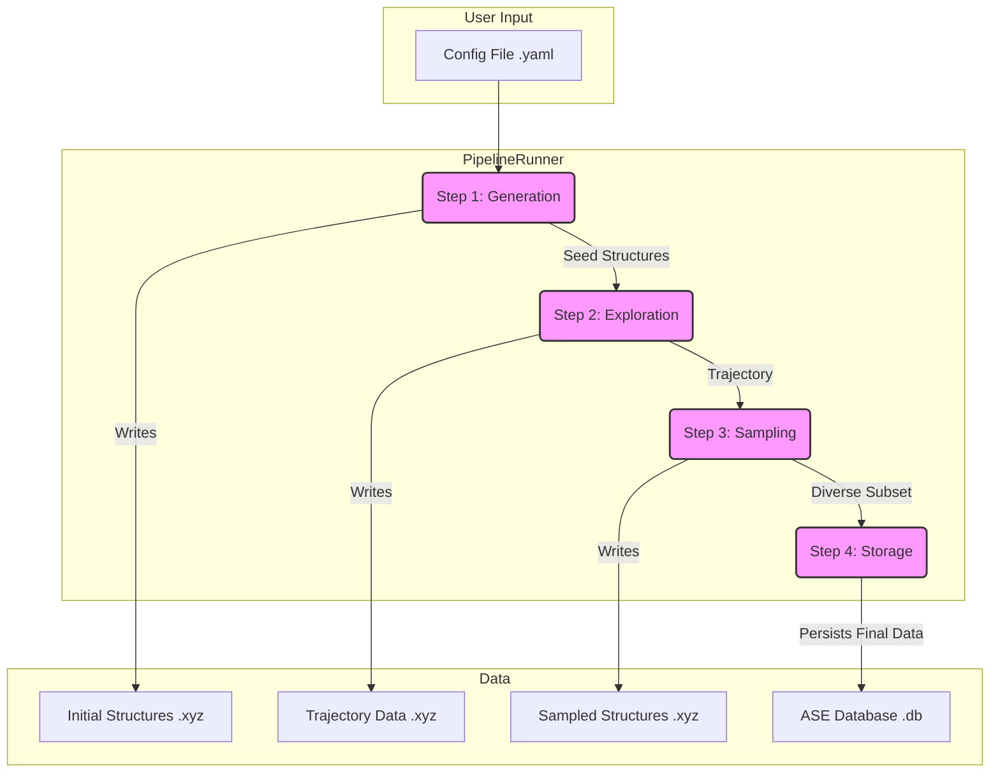

# System Architecture: MLIP-AutoPipe

## 1. Summary

The "MLIP-AutoPipe" project is a sophisticated, automated software framework designed to address a critical bottleneck in modern materials science: the generation of high-quality training data for Machine Learning Interatomic Potentials (MLIPs). MLIPs, such as MACE and SevenNet, represent the cutting edge in computational materials modelling, offering the accuracy of quantum mechanical calculations at a fraction of the computational cost. However, the predictive power of these models is fundamentally limited by the quality and diversity of the atomic structure datasets they are trained on. Manually creating these datasets is a laborious, time-consuming, and often incomplete process that relies heavily on expert intuition. This project aims to replace these ad-hoc workflows with a robust, physics-informed, and highly automated pipeline. The core philosophy is to "remove the human expert from the loop," creating a system that enables both novices and seasoned researchers to generate superior, comprehensive training datasets with minimal effort and maximum reproducibility.

The system is engineered to produce atomic configurations that are not only physically realistic but also strategically diverse, covering a wide swath of the potential energy surface. It moves far beyond simple random structure generation by actively simulating the thermodynamic behaviour of materials. Using a powerful combination of Molecular Dynamics (MD) and Monte Carlo (MC) simulations, the pipeline meticulously explores the accessible phase space of a material to discover a rich variety of atomic arrangements. This exploration is designed to find everything from stable, low-energy ground states to the high-energy, distorted configurations that often represent the "failure points" for a developing model. It also seeks out the crucial transition states between different material phases. By systematically and automatically collecting these scientifically valuable structures, the framework ensures that the resulting MLIP is robust, accurate, and capable of predicting material properties across a wide range of conditions, including those involving extreme temperatures, high pressures, and complex defects.

At its core, MLIP-AutoPipe is designed for modularity and extensibility, allowing it to handle a vast and growing array of physical systems. The architecture provides native support for everything from simple multi-component alloys and ionic crystals to more complex and computationally demanding systems like grain boundaries, interfaces between different materials (heterostructures), and molecules adsorbed onto surfaces. A key feature that sets it apart is its "knowledge-based" generation capability. This allows the system to infer and construct plausible crystal structures directly from a simple chemical formula (e.g., Fe3Pt), leveraging crystallographic databases and fundamental symmetry principles to create intelligent starting points for simulations. The entire end-to-end workflow is orchestrated by a central pipeline runner that manages a clear four-stage process: initial structure **Generation**, thermodynamic **Exploration**, intelligent data **Sampling**, and final, organized **Storage**. This structured, state-isolated approach guarantees reproducibility, enhances fault tolerance, and promotes a clear separation of concerns. This makes the system not only powerful but also highly maintainable and easy to extend in the future. By automating this traditionally arduous task, MLIP-AutoPipe will significantly accelerate the development and deployment of next-generation materials models, paving the way for faster discovery and design of novel materials with desired properties.

## 2. System Design Objectives

The primary objective of the MLIP-AutoPipe framework is to fully automate the generation of diverse, physically-sound datasets for training MLIPs. The design is guided by several key principles and goals aimed at creating a tool that is robust, flexible, and user-friendly.

**Goals:**
1.  **Automation and Reproducibility:** The foremost goal is to create a "push-button" solution. Users should be able to define a physical system in a simple configuration file and receive a high-quality dataset without needing to manually intervene in the intermediate steps. Every stage of the pipeline, from generation to storage, must be logged and based on deterministic principles to ensure that any given experiment is fully reproducible.
2.  **Physical Realism:** The generated structures must obey fundamental physical laws. This is achieved through rigorous validation checks, such as ensuring atoms do not overlap unrealistically. More importantly, the exploration phase uses real physical simulation techniques (MD/MC) to ensure that the generated configurations are thermodynamically accessible and representative of the material's actual behaviour.
3.  **Structural Diversity:** A successful MLIP must be trained on a wide variety of atomic environments. The system is designed to maximise this diversity. It does this by applying volumetric strains and random "rattles" to initial structures, and by using advanced sampling techniques like Farthest Point Sampling (FPS) to select a set of structures that are maximally different from one another.
4.  **Modularity and Extensibility:** The architecture must be modular to easily support new types of physical systems, new simulation engines, or new sampling algorithms. This is achieved through a factory pattern and a base-class inheritance structure for key components like the structure generators. Adding support for a new material type should be as simple as creating a new generator class that adheres to the established interface.
5.  **User-Friendliness and Accessibility:** The project will cater to a wide range of users, from domain experts to students. This is accomplished by providing two primary interfaces: a powerful Command-Line Interface (CLI) for batch processing and automated workflows, and an intuitive Web User Interface (UI) for interactive exploration, visualisation, and configuration.

**Constraints:**
1.  **Dependency on External Libraries:** The project will be built upon the robust foundations of the Python scientific computing ecosystem. Key dependencies will include the Atomic Simulation Environment (ASE) for representing atomic structures, Hydra for configuration management, and libraries like PyTorch for interacting with MLIP models. The design must be compatible with the data structures and conventions of these libraries.
2.  **Computational Resources:** MD simulations are computationally intensive. The design must be mindful of resource limitations. It will incorporate parallel processing to leverage multi-core CPUs and include mechanisms to manage GPU resources carefully, especially when using PyTorch-based MLIP models in a multi-process environment.
3.  **Platform Compatibility:** As a containerised application, the primary deployment target is Linux-based environments, which are standard in high-performance computing. While not a primary objective, the code should be written in a platform-agnostic way where possible.

**Success Criteria:**
1.  **Dataset Quality:** The ultimate measure of success is the performance of an MLIP trained on a dataset generated by the tool. A successful dataset will result in a model with low prediction errors for energies and forces, and the ability to run stable, long-duration MD simulations.
2.  **Pipeline Completion:** The automated pipeline should run from start to finish without errors for a well-defined set of use cases, such as generating a dataset for a binary alloy.
3.  **User Adoption:** The tool should be well-documented and easy enough to use that it becomes a preferred method for dataset generation within the target research community.

## 3. System Architecture

The MLIP-AutoPipe framework is designed as a sequential, four-stage pipeline orchestrated by a central `PipelineRunner`. This architecture ensures a clear and logical flow of data, with each stage responsible for a distinct task. The stages are isolated, with data being saved to disk and a checkpoint database after each major step, providing fault tolerance and the ability to resume a failed run. This design is crucial for long-running simulations, as it prevents the loss of valuable computational work in the event of a crash or interruption. Each stage consumes the output of the previous one, creating a predictable and debuggable workflow.

**The Four Stages:**

1.  **Generation:** This is the entry point of the pipeline and is responsible for creating the initial "seed" structures. The `Generator` component is not a single entity but a factory that selects the appropriate specialized generator (e.g., `AlloyGenerator`, `IonicGenerator`, `InterfaceGenerator`) based on the user's high-level configuration. This factory-based approach is central to the system's extensibility. These generators are programmed with domain-specific knowledge and apply a series of physical constraints and augmentations to the structures they create. Standard procedures include rigorous checks for atomic overlap to discard physically impossible configurations, automatic supercell expansion to ensure the simulation cell is larger than the potential's cutoff radius (preventing self-interaction artifacts), and the application of random perturbations (rattles) and volumetric strains. These augmentations are not random noise; they are crucial for creating an initial, diverse set of structures that provides a good starting point for the exploration phase.

2.  **Exploration:** This is the computational core of the pipeline. The `Explorer` component takes the seed structures and uses them to initiate complex simulations. It employs either pure Molecular Dynamics (MD) or a more advanced hybrid MD/Monte Carlo (MD/MC) engine to simulate the material's thermodynamic behavior under user-defined conditions (e.g., temperature and pressure). This process effectively "explores" the potential energy surface of the material, generating a long trajectory of atomic configurations that represent a wide range of thermally accessible states. The explorer is engineered for robustness, incorporating advanced features like automatic ensemble switching (e.g., correctly choosing an NPT ensemble for bulk materials and an NVT ensemble for surfaces with vacuum slabs) and the dynamic mixing of a ZBL potential to handle the high-energy repulsion when atoms get too close, preventing unrealistic atomic fusions and simulation crashes at high temperatures.

3.  **Sampling:** The exploration stage can produce an enormous volume of data—millions of correlated atomic configurations. The `Sampler` component’s critical role is to intelligently select a small, diverse, and representative subset of these structures that will be most effective for training an MLIP. The system supports multiple strategies. The baseline is a simple random sampling, but the true power comes from the more advanced Farthest Point Sampling (FPS). FPS uses mathematical structural descriptors (like SOAP) to map each atomic configuration to a point in a high-dimensional space. It then selects a subset of points that are maximally distant from one another, ensuring the final dataset is not redundant and covers the widest possible range of unique atomic environments.

4.  **Storage:** Finally, the carefully sampled structures are passed to the `Storage` component. This module is responsible for saving the final dataset into a persistent, queryable, and standardized format. It utilizes the well-regarded ASE database format (backed by SQLite), which stores not only the atomic coordinates for each structure but also a rich set of metadata, including the calculated potential energy, atomic forces, system stress tensor, and provenance information about how the structure was generated.

This entire process is configured via Hydra, allowing for flexible and powerful control over every parameter of the workflow from the command line.

**Mermaid Diagram of System Architecture:**



## 4. Design Architecture

The software is designed with a clear, modular, and object-oriented structure to promote maintainability, testability, and extensibility. The project is organized into a main Python package, `mlip_autopipec`, located under the `src/` directory. This design adheres to standard Python packaging practices and follows the principle of separation of concerns, where each module has a distinct and well-defined responsibility.

**File Structure (ASCII Tree):**

```
src/mlip_autopipec/
├── cli/
│   ├── __init__.py
│   └── main.py              # Main CLI entry point (using Click/Typer)
├── common/
│   ├── __init__.py
│   └── pydantic_models.py   # Core Pydantic configuration and data models
├── generators/
│   ├── __init__.py
│   ├── base.py              # BaseGenerator abstract class
│   └── alloy.py             # Concrete implementation for alloys
├── explorers/
│   ├── __init__.py
│   └── md_engine.py         # MD and hybrid MD/MC simulation engine
├── samplers/
│   ├── __init__.py
│   ├── base.py              # BaseSampler abstract class
│   └── fps.py               # Farthest Point Sampling implementation
├── storage/
│   ├── __init__.py
│   └── database_manager.py  # Handles writing to the ASE database
├── pipeline/
│   ├── __init__.py
│   └── orchestrator.py      # The main PipelineOrchestrator class
├── interfaces.py            # Defines abstract interfaces for dependency injection
├── factories.py             # Factories for creating concrete generator/sampler instances
└── __main__.py              # Allows running the CLI with `python -m mlip_autopipec`
```

**Class/Function Overview:**

*   `cli.main`: This module implements the primary user-facing command-line interface. It will use a modern CLI library like Typer or Click to define commands and arguments. Its main responsibility is to handle user input, parse the path to the configuration file, and orchestrate the setup and execution of the pipeline. It will be responsible for instantiating the main `PipelineOrchestrator` and injecting the necessary dependencies.

*   `pipeline.orchestrator.PipelineOrchestrator`: This is the central coordinating class of the entire application. It is initialized with a validated configuration object and manages the execution of the four-stage pipeline. It calls the appropriate components (generators, explorers, etc.) in the correct sequence and manages the flow of data (typically file paths) between them. It is the "brain" of the operation.

*   `common.pydantic_models`: This is a critical file that will contain a set of Pydantic models defining the entire structure of the user's configuration files. There will be a top-level `FullConfig` model composed of smaller, more specific models like `SystemConfig`, `ExplorationConfig`, and `SamplingConfig`. This schema-first approach provides rigorous, automatic validation of all user input, with clear error messages for mistakes, preventing a whole class of potential runtime errors.

*   `generators.base.BaseStructureGenerator`: This file defines the abstract base class for all structure generators. It will specify a common interface (a `generate()` method) that all concrete generators must implement. This enforces a consistent structure across the module and is key to the factory pattern's ability to treat all generators polymorphically.

*   `explorers.md_engine.MDEngine`: This class encapsulates all the complex logic for running MD and hybrid MD/MC simulations. It will be initialized with an ASE-compatible calculator (like MACE or SevenNet) and will manage the details of the simulation, such as the integrator, thermostat, barostat, and the logic for ensemble switching and potential mixing.

*   `samplers.base.BaseSampler`: Similar to the generator, this defines the abstract base class for all sampling algorithms. It will define a `sample()` method that takes a trajectory and returns a list of selected `Atoms` objects.

*   `storage.database_manager.DatabaseManager`: This class provides a simple, clean interface for all database operations. It will abstract away the specific details of the `ase.db` library, providing methods like `connect(path)` and `write_structures(structures)`, making the main pipeline logic cleaner and more readable.

*   `factories.py`: This module implements the factory design pattern. It will contain functions like `create_generator(config)` and `create_sampler(config)`. These functions will inspect the configuration object and, based on its values (e.g., `config.sampling.method`), will instantiate and return the appropriate concrete implementation (e.g., `FarthestPointSampler`). This decouples the main application logic from the specific component implementations, making the system highly modular.

**Data Models (Pydantic):**

The system's configuration will be strictly defined by Pydantic models to ensure robustness. This provides a single source of truth for all settings.

```python
# Example from common/pydantic_models.py

from pydantic import BaseModel, Field
from typing import List, Dict

class SystemConfig(BaseModel):
    elements: List[str]
    composition: Dict[str, float]
    supercell_size: List[int] = Field(..., min_items=3, max_items=3)
    # ... other system parameters

class MDConfig(BaseModel):
    temperature_k: float = Field(..., gt=0)
    pressure_gpa: float
    # ... other MD parameters

class FullConfig(BaseModel):
    system: SystemConfig
    exploration: MDConfig
    # ... other config sections
```
This schema-first approach is fundamental. It allows for automatic validation of user configuration files against a well-defined schema, providing clear, targeted error messages and preventing entire classes of runtime errors that would arise from invalid or missing parameters. It also serves as a form of machine-readable documentation for the system's capabilities.

## 5. Implementation Plan

The project will be developed over two distinct cycles, building from a core functional command-line tool to an advanced, user-friendly framework.

**Cycle 1: Core CLI Pipeline and Foundational Components**

The primary goal of the first cycle is to deliver a functional, end-to-end command-line tool capable of generating a basic dataset for a simple physical system (e.g., a binary alloy). This cycle focuses on establishing the core architecture, data models, and the main pipeline logic. The emphasis will be on robustness and correctness over feature completeness.

The implementation will begin with the strict definition of all configuration parameters using Pydantic models in `common/pydantic_models.py`. This schema-first approach will dictate the required inputs for the entire system. Next, the foundational `PipelineOrchestrator` will be created, outlining the four main steps (Generate, Explore, Sample, Store) as distinct methods. The `cli/main.py` entry point will be developed to parse a Hydra configuration file and trigger the orchestrator.

For the **Generation** stage, we will implement the `BaseStructureGenerator` abstract class and a concrete `AlloyGenerator`. This generator will be capable of creating simple alloy structures, applying necessary rattles and strains, and performing overlap checks. For the **Exploration** stage, a basic version of the `MDEngine` will be implemented. It will support standard NVT and NPT MD simulations using an ASE-compatible calculator, but will not yet include the advanced hybrid MD/MC features. In the **Sampling** stage, a simple `RandomSampler` will be created as the default method for selecting structures from the MD trajectory. Finally, the **Storage** stage will be implemented with a `DatabaseManager` that can connect to an ASE database and save the final sampled structures with their corresponding metadata. The focus is on ensuring the data flows correctly through all four stages and that the final database is correctly populated.

**Cycle 2: Advanced Exploration, Intelligent Sampling, and Web UI**

Building on the stable foundation of Cycle 1, the second cycle will focus on implementing the advanced features that provide the core intellectual property and user-facing value of the project. This cycle will significantly enhance the quality of the generated datasets and the usability of the tool.

The **Exploration** engine (`MDEngine`) will be upgraded to include the hybrid MD/MC capabilities. This involves implementing the logic for Monte Carlo moves, such as atomic swaps for alloys and vacancy hops, which are crucial for efficiently exploring the configuration space. This will also include the implementation of the "auto ensemble switching" logic, which detects vacuum slabs and applies the correct thermodynamic ensemble (NVT) to prevent simulation artifacts.

Next, the **Sampling** module will be enhanced with the implementation of `FarthestPointSampler`. This requires integrating a library to compute structural descriptors (like SOAP) and implementing the FPS algorithm itself to enable intelligent, diversity-driven data selection. This is a critical step up from the simple random sampling of Cycle 1.

The most significant new component in this cycle will be the development of a **Web User Interface**. This will be a separate application (e.g., using Streamlit or FastAPI with a React frontend) that provides a graphical way for users to build configuration files, launch pipeline runs, and, most importantly, visualise the atomic structures at different stages of the process. The UI will interact with the core `mlip_autopipec` package, using it as a library. This will lower the barrier to entry for new users and provide powerful interactive capabilities for experts. The backend logic will be reused from the CLI, ensuring consistency between the two interfaces.

## 6. Test Strategy

A comprehensive testing strategy is essential for ensuring the correctness, robustness, and reliability of the MLIP-AutoPipe framework. The strategy will be multi-layered, encompassing unit, integration, and end-to-end testing, with a specific focus for each development cycle.

**Cycle 1: Core Pipeline Validation**

In the first cycle, the testing focus is on validating the correctness of individual components and the integrity of the data flow through the CLI pipeline.

*   **Unit Testing:** Each core component will be tested in isolation. The `AlloyGenerator` will have unit tests to verify that it produces the correct number of atoms, respects the specified composition, and that its validation checks (e.g., `overlap_check`) correctly reject invalid structures. The `Pydantic` models themselves will be tested to ensure validation rules work as expected. The `DatabaseManager` will be tested using a mock database to confirm that it writes the expected data and metadata. Mocks will be heavily used to isolate components; for example, when testing the `PipelineOrchestrator`, the actual `MDEngine` will be replaced with a mock that produces a predictable, dummy trajectory file. This ensures that tests are fast and deterministic.

*   **Integration Testing:** The primary integration test for Cycle 1 will be an end-to-end test of the CLI. The test will invoke the command-line tool with a minimal, valid configuration file for a binary alloy. It will run the entire pipeline on a small scale (e.g., few atoms, short MD run). Assertions will be made at each stage: checking that the initial structure file is created, that a trajectory file is generated, and, most importantly, that the final ASE database contains the expected number of structures and that the metadata (energy, forces) is correctly populated. This test will not verify the scientific accuracy of the simulation but will confirm that all the components are wired together correctly and that data is not lost or corrupted between stages.

**Cycle 2: Advanced Features and UI Testing**

The testing strategy for Cycle 2 expands to cover the new, more complex features and the user-facing web application.

*   **Unit Testing:** The new advanced components will have dedicated unit tests. The logic for the hybrid MD/MC moves in the `MDEngine` will be tested to ensure atoms are swapped correctly and that invalid moves (e.g., those violating charge constraints) are rejected. The `FarthestPointSampler` will be a key focus.. It will be tested with a known set of input vectors to ensure the algorithm correctly selects the points that are farthest apart, validating the core selection logic. For the Web UI, unit tests will be written for backend API endpoints, mocking the core pipeline logic to ensure the API handles requests and returns responses correctly.

*   **Integration and End-to-End Testing:** An integration test will be added for the advanced CLI workflow, specifically enabling the hybrid MD/MC and FPS options and verifying that the resulting dataset in the database is consistent with the settings. The most critical new test will be an end-to-end test for the Web UI. We will use a browser automation framework like Playwright or Selenium. The test script will automate the process of a user opening the web page, filling out the configuration form, clicking the "Run" button, and then verifying that the UI updates to show that the process has completed and that the expected output (e.g., a downloadable database file or a visualisation of a final structure) is present. This test ensures that the entire user-facing workflow is functional, from browser interaction to backend processing.